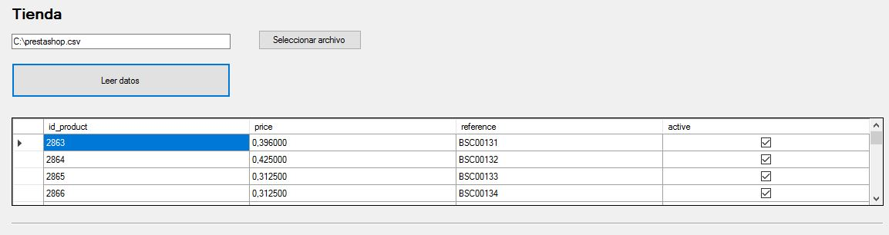
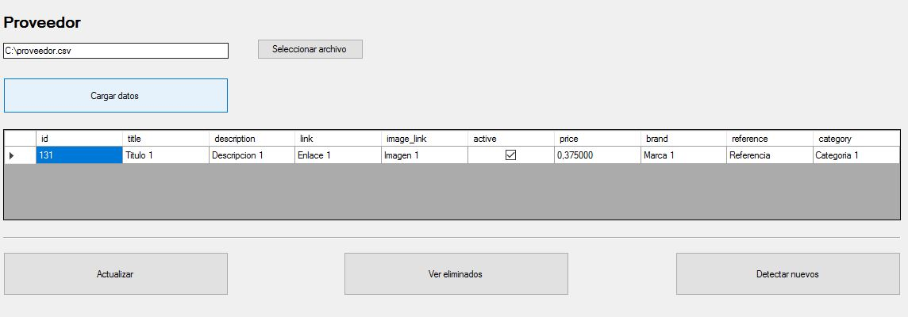
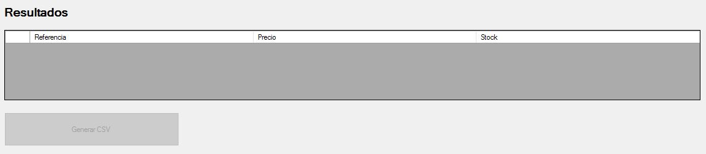

# Introducción #

Aplicación que ayuda a crear archivos CSV para cargar y actualizar productos de un proveedor en una tienda Prestashop.

Suponiendo que el catálogo de la tienda sea necesario actualizarlo periodicamente con archivos CSV que envia un proveedor (ejemplo Dropshipping), esta aplicación ayuda a las siguientes tareas:

- generar CSV para actualizar precio y stock de los artículos que ya existen en el catálogo
- indicar los que ya han sido eliminados (descatalogados) por el proveedor
- generar un CSV con los nuevos artículos a importar.

## Requisitos ##

- Visual Studio
- [FileHelpers Library](http://www.filehelpers.net/)

## Interfaz ##

### Sección tienda ###



Elige un archivo CSV descargado desde el backOffice de Prestashop. 
Por defecto este archivo debe esta formado por los campos:

- id_product
- price
- reference
- active

Para obtener este archivo, hay que acceder al backOffice de la tienda Prestashop, ir a la sección Parámetros avanzados/Consultas MySQL (puede variar dependiendo de la versión) y crear una nueva consulta

```
SELECT p.id_product, p.price, p.reference, p.active
FROM ps_product p

```


### Sección proveedor ###



Elige un archivo CSV proporcionado por el Proveedor.
Por defecto estos archivo deben tener el siguiente formato (se puede cambiar facilmente, modificando la clase **SupplierFile**).

- Caracter delimitador: | (pipe)
- Campos: id, title, description, link, image_link, active, price, brand, reference, category


Tres acciones disponibles:
- Actualizar: Genera una lista con los precios y stock actualizados de los productos que ya existen en la tienda.
- Ver eliminados: Genera la lista de artículos descatalogados
- Detectar nuevos: Genera una lista de nuevos artículos.


### Sección Resultados ###



Muestra la lista generada y permite guardarla en un archivo CSV para importalo desde el backOffice de Prestashop. Estos archivos utilizan por defecto el caracter *punto y coma* (;) como delimitador de campos.


## Personalizar proveedor ##

Para ajustar el programa a los campos utilizados en el CSV del proveedor, será necesario modificar la clase **SupplierFile.cs**

Se utiliza la librería FileHelpers para leer y crear archivos CSV, si se desea realizar alguna moficación, se recomienda consultar la [documentación](http://www.filehelpers.net/mustread/) de esta librería.